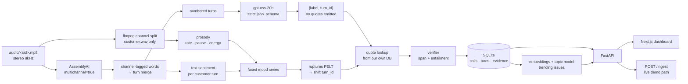

# The Radar Playbook

**Call-Centre Radar — architecture and build plan**

The brief has a trap door built in: *"a claim with no evidence scores zero; evidence that doesn't support the claim scores negative."* Most teams will bolt an LLM onto a transcript and hope its vibes hold up under a judge's click. This plan is built around never needing hope — every mood, intent, and score is produced by something measurable, and the system cannot emit a citation it hasn't verified.

> **Revision note.** This document was rewritten after measuring the actual dataset. The first draft assumed ~120 hours of audio and a flat metadata schema; both were wrong, and several decisions downstream of them changed. Everything marked **measured** below was verified directly against the files in `data/`.

---

## The corpus — measured, not assumed

| Fact | Value |
|---|---|
| Calls | 1,441 (audio and metadata fully paired) |
| **Total audio** | **23.28 hours** — not the ~120 originally assumed |
| Call length | mean 58.2s, median 56s, range 18.7s–181.6s |
| Format | stereo, 8 kHz, 48 kbps mp3 — **all 1,441**, verified by ffprobe |
| Channel separation | L/R differ by 2.5–5 dB RMS — genuinely separate signals |
| On-disk | 481.8 MB audio + 1.25 MB metadata |
| Customers | **100**, every one with multiple calls (mean 14.4, max 27) |
| Agents | 10 names |
| Distinct days | **4** — 2020-03-15, 05-30, 06-01, 06-02 |

**Consequences that drive the whole plan:**

- 23 hours is small. The full batch costs ~$7 on AssemblyAI or ~1 hour on 12 CPU cores. There is no reason to lazy-transcribe, subset the data, or chase GPU infrastructure.
- Every customer is a repeat caller. Repeat-contact detection isn't a nice-to-have here; it's the strongest signal the data contains.
- Four non-contiguous days across a 2.5-month gap means "trending over time" is nearly meaningless as a time series. See *Product decisions the data forces*.

### The metadata schema is nested, with one hostile key

```json
{ "sid": "004860b1ab2e4c88",
  "start_time_ms": 1590860609249, "end_time_ms": 1590860654497,
  "agent":  { "metadata": { "agent_name": "Robert" },              "speaker_id": 17 },
  "caller": { "metadata": { "first and last name": "Mary Smith" }, "speaker_id": 44 },
  "labels": { "lhvb_script": 5.0, "caller_mos": 3.0, "agent_mos": 3.0 },
  "session": "Little Harper Valley 2" }
```

All 1,441 files share this exact shape, so no defensive parsing is needed — but three traps are:

1. The customer name key is literally `"first and last name"`, with spaces. Not `name`.
2. Timestamps are **epoch milliseconds**, not ISO strings.
3. **`speaker_id` is not a person ID.** "Mary Smith" maps to 14 different `speaker_id`s; agent "Robert" to 42. These are crowdworkers reading roles. **Key customers and agents on name.** Building on `speaker_id` would silently corrupt the customer list, call history, and repeat-contact detection.

`session` and `labels.lhvb_script` (2 distinct values) confirm this is derived from the Gridspace–Stanford *Harper Valley Bank* corpus. If upstream reference transcripts exist, use them for **eval only**, never in the product, and say so.

---

## Why this wins — four bets

**01 — Free speaker attribution, validated rather than blindly trusted.**
Left channel is the agent, right is the customer. We never diarize. Most teams will downmix to mono and fight an error-prone diarization model, then still have to guess which anonymous "Speaker A" is the agent.

That convention held for 97.6% of the corpus for free, by construction. It didn't hold for the other 2.4%: 35 of 1,441 recordings genuinely have the channels swapped in the source audio — caught because the agent's own scripted opening line ("Hello, this is Harper Valley National Bank...") showed up on the channel we'd labelled customer. A pipeline that trusts channel identity unconditionally would have shipped every one of those 35 with agent and customer's entire conversation reversed — wrong intent, wrong resolution, wrong everything downstream, with no error anywhere to catch it. `scripts/fix_channel_swaps.py` detects the swap against the one thing that's actually deterministic in this corpus (the agent's script), corrects it, and re-derives everything from the corrected transcript. The claim isn't "channel identity is infallible" — it's "we don't trust an assumption further than we can verify it," which is the same principle behind every other differentiator here, applied one layer earlier.

**02 — Hallucinated citations are structurally impossible.**
The LLM is never allowed to write a quote. It returns a `turn_id` under a strict JSON schema; *we* look up the verbatim text from our own database. This is stronger than checking quotes after the fact — there is nothing to check, because the model never authored the text.

**03 — The verifier checks support, not just presence.**
Fuzzy-matching proves a quote exists. It does not prove the quote *justifies the claim* — and the brief penalises exactly that. A second check (embedding similarity, or an NLI cross-encoder) scores claim-vs-quote entailment before storage. This is the half of the rubric nobody else will implement.

**04 — Mood you can measure.**
Mood is a scored time series, and the shift point is a change-point detection result — not an LLM's opinion. The chart on screen and the cited "why" are the same computation.

**05 — Resolution Reality Check: the agent's word isn't the last word.**
"Resolved" is an LLM judgment about the whole transcript; it can still be wrong the same way a human summarizer can be. So a second, fully rule-based pass (`pipeline/reality_check.py`) checks the thing that actually matters: does the customer's OWN later turn back up "resolved", or contradict it? No LLM call, no new failure mode — just a phrase match on the agent's claim ("you should be all set") and, strictly after it, one on the customer's pushback ("still not working", "same problem"). Both quotes still go through the same evidence verifier as every other citation. Measured on this corpus: 0/1,303 resolved calls trip it — same honest result as mood-shift and escalation, because these are scripted, polite calls with nothing to contradict. It's built to catch the case this corpus doesn't have, demo-able the same way the mood-shift detector is: feed it a call where the customer pushes back after the agent's claim, via `/ingest`.

Alongside it, every call and the dashboard header now surface an **Evidence Coverage Score** — the % of that call's (or the whole corpus's) citations that actually passed verification, straight from `evidence.verified`. No new storage, no new pipeline stage: the number the eval harness already computes, put in front of the person using the product instead of buried in a test report.

---

## Architecture



---

## The stack

| Layer | Choice | Why this one |
|---|---|---|
| **Bulk ASR** | AssemblyAI `multichannel=True` | One request per call returning channel-tagged words. ~46.6 channel-hours × $0.15 ≈ **$7** of the $50 credit. No ffmpeg split needed for ASR. |
| **Live `/ingest` ASR** | Groq `whisper-large-v3-turbo` | $0.04/hr, an hour of audio in ~15s. A judge's call transcribes in ~2s on stage. |
| **Offline ASR** | `faster-whisper small.en` int8 | Zero key, zero network. Keeps "runs from scratch" true and is the demo-day safety net. |
| **Speaker attribution** | stereo channels | Correct by construction. **Never** `speaker_labels`. |
| **Reasoning** | Groq **`openai/gpt-oss-20b`** | **Only the `gpt-oss` models support strict `json_schema` on Groq** — everything else is `json_object` (valid JSON, no schema adherence). 1000 tok/s, production tier. |
| **Reasoning fallback** | Ollama `qwen3:8b` + `format` schema | Offline path. 7-8B class, not 14B — Docker has 8 GB. |
| **Text sentiment** | small local classifier per turn | Carries ~all the mood signal on this corpus |
| **Prosody** | speaking rate, pause length, RMS — from word timestamps | Cheap. Deliberately not pitch-tracking; see *Rejected*. |
| **Change point** | `ruptures` PELT, 3-turn smoothed | Guard n<5; smooth before detecting or you detect noise |
| **Embeddings** | `bge-small-en-v1.5` (33M) | CPU-fast, ample for ≤40-word summaries |
| **Clustering** | BERTopic → **FASTopic** if noisy | Short text is BERTopic's weak spot. If the `-1` noise cluster exceeds ~30%, switch to FASTopic (NeurIPS 2024) — faster and more coherent on short docs. |
| **Verification** | `rapidfuzz` + entailment check | The rubric, as code |
| **Storage** | SQLite + transcript JSON disk cache | Precomputed once, read-only at request time |
| **Backend** | FastAPI | Auto OpenAPI docs, one process |
| **Frontend** | Next.js 16 (App Router) + Tailwind v4 | Rewrites `/api/*` and `/audio/*` to FastAPI — no CORS, and audio Range requests stay same-origin |
| **Eval** | `jiwer` + the verifier's own pass rate | Numbers a judge can't wave away |

### Voice-based emotion — tested and rejected

`emotion2vec+` is the current state of the art for speech emotion recognition
and is used in production call-centre tooling, so it was worth trying rather
than dismissing. The argument for it here was specific: this corpus is *acted*,
so delivery might carry affect the transcript doesn't.

Run over the 20 calls our text scoring rated most negative, it returned:

| | |
|---|---|
| neutral | 13 |
| sad | 3 |
| fearful | 2 |
| happy | 1 |
| disgusted | 1 |

Five labels, but no signal. Text and voice agreed nowhere: the most negative
call in the corpus (-0.57) came back **fearful**, another at -0.39 came back
**happy**, and a savings-balance enquiry came back **disgusted** — with
`fearful` at confidence 1.00, which is characteristic of a model outside its
training distribution rather than one that is sure.

The cause is bandwidth. emotion2vec trains on 16 kHz; this is 8 kHz telephony at
48 kbps. The spectral detail emotional cues live in was discarded by the phone
system before we ever saw the file, and upsampling for the ASR does not restore
it.

Rejected on the grounds that five confident-but-unverifiable affect labels on
the dashboard is exactly the trade this system exists to avoid. Mood is scored
from text and timing, both of which can be evidenced.

### Explicitly rejected

- **Diarization** (any provider) — adds error to a solved problem and costs extra.
- **AssemblyAI's sentiment / auto-chapters / summarization add-ons** — ungrounded judgments we don't control defeat the entire architecture. Buy the transcript; keep the intelligence ours.
- **Speech emotion recognition models** — every open SER model is trained on clean 16 kHz *acted* studio speech (RAVDESS/IEMOCAP). Our audio is 8 kHz telephony at 48 kbps, and is itself scripted. It won't transfer.
- **`librosa.pyin` pitch tracking** — slow, and noisy on codec-degraded 8 kHz.
- **GPU-tier ASR** (Canary-Qwen, Parakeet-TDT) — both need 8 GB+ VRAM. No GPU available, and 23 hours doesn't need one.
- **Lazy / on-click transcription** — see below.

### Why the full corpus must be precomputed

The permissive line in the brief — *"how you store the analysis is your design decision. Do not re-transcribe on every request"* — reads like it allows transcribe-on-click. Two other requirements forbid it:

> *"Across all calls: which calls need a manager's attention today, **ranked**; which issues are **trending**; and a per-agent view of call volumes, handle times and **outcomes**."*

You cannot rank calls you haven't scored, cluster issues you haven't extracted, or compute a resolution rate over calls you haven't analysed. Three required views collapse without the full batch. And *"ready to demonstrate live on calls we choose on the day"* makes lazy actively dangerous — a judge picks a call and the room watches it transcribe.

On-demand processing has exactly one correct home: `POST /ingest`, for a recording that was never in the dataset.

---

## Pipeline stages

**1 · Transcription.** Submit the stereo mp3 with `multichannel=True`; the response carries `audio_channels` and per-utterance `channel` labels with word timestamps. Merge both channels' segments by start time, collapsing consecutive same-speaker segments into turns and flagging genuine time-overlaps as crosstalk rather than forcing false sequential order.

**Cache every transcript response to `data/cache/<sid>.json` before any downstream work.** The analysis layer gets re-run twenty times while tuning prompts; it must never re-transcribe. This single decision is the difference between a 10-second iteration loop and a 1-hour one.

**2 · Mood.** Per customer turn: text sentiment fused with speaking rate, pause length, and RMS energy — the latter three derived from word timestamps already in hand. Documented weights (~0.7 text / 0.3 prosody), not a black box. Smooth over 3 turns, then run PELT for the shift point.

**3 · Grounded reasoning.** Feed numbered turns to `gpt-oss-20b` under a strict schema:

```json
{ "intent":     {"label": "dispute a duplicate charge", "turn_id": 4},
  "resolution": {"status": "unresolved",                 "turn_id": 38},
  "summary":    "Customer disputes a duplicate charge; agent opens a case but gives no refund timeline." }
```

No `quote` field exists in the schema. We resolve `turn_id` → verbatim text ourselves. Strict mode requires all fields `required` and `additionalProperties: false`; use `["string","null"]` unions for optional fields.

**4 · Verification.** For each resolved evidence object: confirm the span within the turn (`rapidfuzz`, minimum ~5-word quotes — short quotes inflate `partial_ratio`), then score claim-vs-quote entailment. Below threshold, the claim is stored **unverified** and rendered as such, never silently shown as fact.

**5 · Attention score.** Computed here, not asked for. Mood severity, mood volatility, resolution status, escalation lexicon hits, handle-time outliers, and repeat-contact each carry a documented weight. The LLM narrates factors; this module owns the arithmetic.

**6 · Cross-call.** Embed summaries, cluster, bucket by day. Same customer + same cluster within N days → repeat contact, which folds back into the attention score.

---

## Product decisions the data forces

**"Today" = 2020-06-02.** Only four days exist. Default the attention view to the latest (406 calls) and expose the other three in a picker. Left as literal "today", the flagship view renders empty on stage.

**Trends lead with cluster size, not a curve.** Four non-contiguous days across a 2.5-month gap is not a trend line. Show which issues dominate, with the day breakdown secondary. Drawing a fake curve invites the one question you don't want.

**Repeat contact is a headline feature.** All 100 customers called multiple times (mean 14.4). "This person has called five times about the same thing" is directly what the problem statement asks for — *"the complaint that came up nine times this week"* — and the data supports it far better than it supports trending.

---

## API surface

| Endpoint | Returns |
|---|---|
| `GET /customers` | Every customer by name, call count, last contact |
| `GET /customers/{id}/calls` | That customer's full call history |
| `GET /calls/{id}` | Turns with speaker + timing, intent, mood timeline + shift, resolution, ≤40-word summary, attention score + factors — each with evidence |
| `GET /attention?date=` | Ranked "needs a manager today", defaulting to 2020-06-02 |
| `GET /trends` | Issue clusters with time-bucketed frequency |
| `GET /agents` | Per-agent volume, handle time, resolution rate |
| `POST /ingest` | Full pipeline on a new recording — the live-demo path |

SQLite, precomputed at ingestion, read-only at request time. Add a dedicated `evidence` table (`call_id, claim_type, turn_id, quote, match_score, verified`) so the eval harness's citation pass-rate is one SQL query rather than JSON spelunking. Index `calls(started_at)`, `calls(attention_score)`, `calls(customer_id)`. An FTS5 virtual table over turn text costs ~10 lines and buys full-text search across all 1,441 calls — a strong demo moment for free.

---

## Build order

The scaffold currently has no working vertical slice. Don't build breadth before one call works end to end.

| Step | Work |
|---|---|
| 1 | Metadata layer + **one call** all the way through: split → transcribe → merge → SQLite → `GET /calls/{id}` rendering in the dashboard |
| 2 | Full transcription batch (~1 hr), caching every response to disk |
| 3 | Read endpoints + dashboard live on real transcripts ← **first demoable milestone; get here fast** |
| 4 | Mood series → change-point shift |
| 5 | LLM reasoning with turn-id citations → verifier → attention score |
| 6 | Clustering, repeat-contact, agent rollups |
| 7 | Eval harness, `/ingest`, rehearse the demo twice |

**If time runs out, cut in this order:** trends → agent rollups → prosody (keep text sentiment alone) → the WER half of eval.

**Never cut:** evidence chips, the verifier, the attention ranking. A dashboard with grounded citations over 400 calls beats an ungrounded one over 1,441.

---

## The evaluation harness — prove it, don't claim it

Two numbers, both cheap:

- **Citation pass rate** — fully automatic. Re-run the verifier over every stored evidence object and report the fraction that pass. No human labelling required.
- **Word error rate** — `jiwer` against a hand-checked gold set. Ten carefully corrected calls beats thirty rushed ones. If upstream Harper Valley reference transcripts turn out to be available, use them and disclose it.

Report the rejection rate honestly — it's a real number either way, and "we rejected 8% of generated citations before they reached the screen" is a stronger claim than silence.

---

## Risks & fallbacks

| Risk | Fallback |
|---|---|
| AssemblyAI credit exhausted or API down | `TRANSCRIBER_PROVIDER=whisper`, config change only — ~1 hr on 12 cores |
| Groq rate-limited mid-batch | Ollama `qwen3:8b` locally; slower but offline |
| Live `/ingest` slow on stage | Start it before you begin talking; narrate the architecture while it finishes |
| Verifier rejects too many claims | Loosen the threshold slightly and **report the rate** — it's evidence of rigour, not failure |
| Clustering produces mostly noise | Switch BERTopic → FASTopic; failing that, cluster intent labels instead of summaries |
| Docker OOM on the LLM | 8 GB allocated of 15.7 GB host — raise via `.wslconfig`, or stay on the 8B-class model |

---

## Demo script

1. **Open with the rule.** Put the brief's own sentence on screen — *"a claim with no evidence scores zero"* — then show every card already carrying a clickable citation.
2. **The channel-split insight in one breath.** Left is the agent, right is the customer. No diarization to get wrong.
3. **Then the sharper version.** Our model never writes quotes — it returns a turn number, and we look up the words. Hallucinated citations aren't caught; they're impossible.
4. **Take a judge's chosen call.** Click the mood shift, hear the exact seconds that caused it.
5. **Feed it a recording nobody has seen.** `/ingest`, live.
6. **Close on the numbers.** WER and citation pass rate from the eval harness.

---

*Built for the Call-Centre Radar brief — 1,441 calls, 23.28 hours, evidence-or-zero scoring.*
