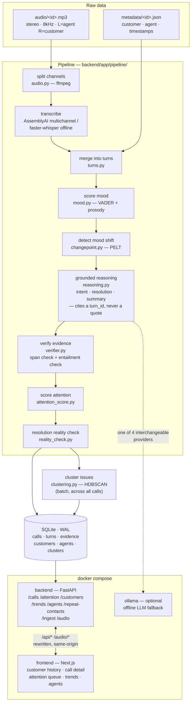
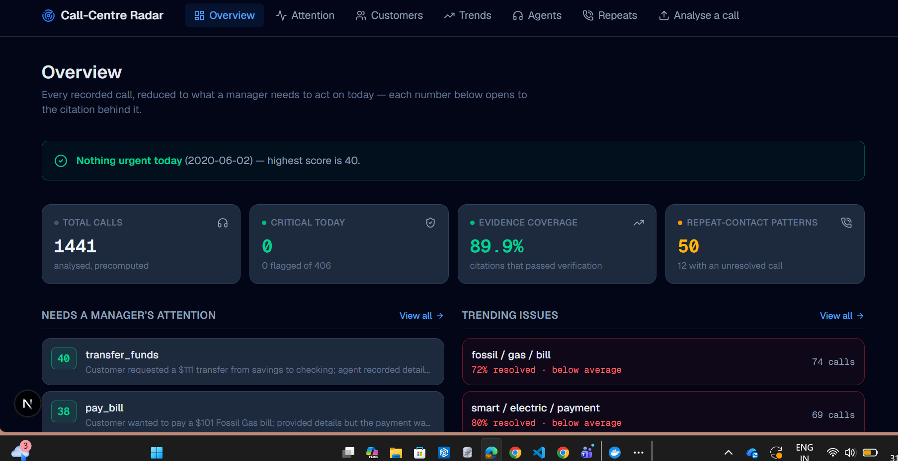
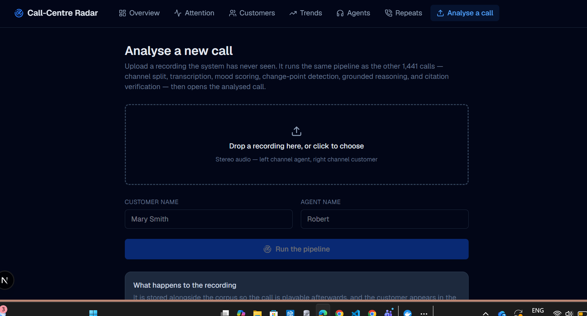
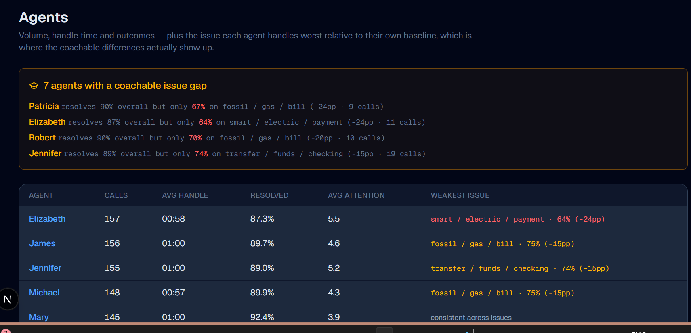
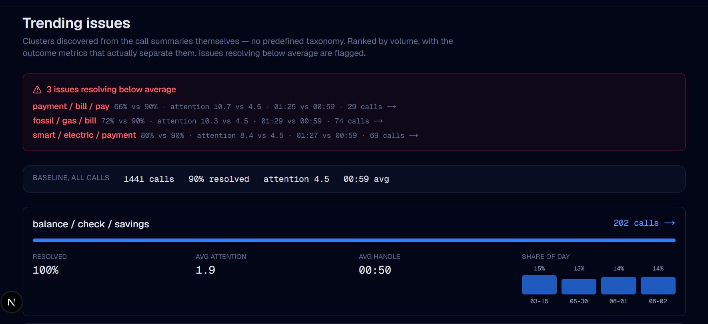
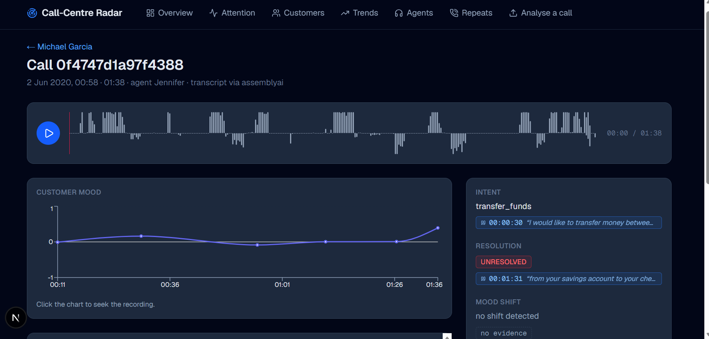

# Call-Centre Radar

Raw stereo call recordings in, a grounded API and admin dashboard out. Every
judgment the system makes — intent, mood shift, resolution, needs-attention
score — carries the timestamp and the words that justify it.

**The design rule: the model is never allowed to write a quote.** It cites a
turn by *number*, under an enforced JSON schema, and the exact words are looked
up from our own transcript. Fabricated citations aren't detected after the fact
— they're structurally impossible to express.

Two checks sit on top of that guarantee, both fully rule-based (no LLM, no new
cost):

- **Resolution Reality Check** — flags a call where the agent's own words claim
  the issue is resolved but the customer's *later* words contradict it. A
  regex match on both sides, run through the same evidence verifier as every
  other citation.
- **Evidence Coverage** — the % of a call's (or the whole corpus's) citations
  that actually passed verification, shown per call and on the dashboard
  header — "how much of what this system told you can you actually trace back
  to the transcript," not just an attention number.

See [RADAR_PLAYBOOK.md](RADAR_PLAYBOOK.md) for the reasoning behind each
choice.

---

## Architecture

Two entry points — the overnight batch and a live `POST /ingest` upload — run
the **identical** pipeline function. Nothing about a demo call is a separate
happy path.



Each stage's own module docstring in `backend/app/pipeline/` explains the
*why* in full — thresholds, rejected alternatives, and what was actually
measured on this corpus — not just the *what* shown here.

---

## Screenshots

<table>
<tr>
<td width="50%">

**Overview** — the admin home page. A stated verdict before any number, stat
cards colored by the same thresholds as everywhere else, previews of
attention/trends/agents that each open to their full page.



</td>
<td width="50%">

**Call detail** — the signature interaction. Every judgment (intent,
resolution, mood shift) sits next to the exact quote and timestamp it came
from; clicking one seeks the waveform to that second.



</td>
</tr>
<tr>
<td width="50%">

**Trends** — issue clusters discovered from the call summaries themselves,
each measured against the corpus-wide baseline (resolved %, avg attention,
avg handle time) rather than shown as a bare count, with each day's *share*
of that issue's calls alongside.



</td>
<td width="50%">

**Agents** — volume, handle time, and outcomes, plus each agent's weakest
issue relative to their *own* baseline — the coaching signal, not a raw
ranking.



</td>
</tr>
</table>

**Live ingestion** — the same pipeline that ran the batch, on a recording
nobody has seen:



---

## Quickstart

**The analysed database ships with this repo.** `data/radar.db` contains all
1,441 calls already transcribed and analysed, so you can skip straight to
serving — no API keys, no cost, no waiting:

```bash
cp .env.example .env
unzip callradar-data.zip -d data/     # audio only; needed for playback
docker compose up backend frontend
```

- Dashboard: **http://localhost:3000**
- API docs: **http://localhost:8000/docs**

`data/cache/` also ships with the raw transcripts, so the analysis layer can be
re-run without paying to transcribe again:

```bash
docker compose run --rm --no-deps backend python scripts/analyze_dataset.py --reanalyze --workers 8
```

---

## Rebuilding from scratch

To regenerate everything from the raw audio, delete `data/radar.db` and
`data/cache/`, then fill in **two** keys in `.env`:

| Variable | For | Getting one |
|---|---|---|
| `ASSEMBLYAI_API_KEY` | transcription | [assemblyai.com](https://www.assemblyai.com) — free credit covers the whole corpus (~$7) |
| `GROQ_API_KEY` | reasoning | [console.groq.com](https://console.groq.com) — free, no card |

```bash
# 1. transcribe — once, cached to data/cache/, never repeated
docker compose run --rm --no-deps backend python scripts/ingest_dataset.py --workers 8

# 2. analyse — mood, reasoning, verified citations, attention, clustering
docker compose run --rm --no-deps backend python scripts/analyze_dataset.py --workers 8

# 3. serve
docker compose up backend frontend
```

Expect roughly **80 minutes** for step 1 and **15 minutes** for step 2.

> **After editing `.env`, run `docker compose up -d --force-recreate backend`.**
> `docker compose restart` does *not* reload environment files, and the symptom
> is a provider error naming credentials you already fixed.

---

## Reasoning providers

Any provider works as long as it enforces a **JSON schema** — that enforcement
is what makes the citation guarantee hold. A provider offering only "valid
JSON" without schema adherence silently breaks the design.

| `LLM_PROVIDER` | Model | Notes |
|---|---|---|
| `groq` | `openai/gpt-oss-20b` | **Default.** Free, fast. Free tier caps at 8k tokens/min and 1k requests/day — fine for `/ingest`, ~3 hours for a full batch |
| `bedrock` | `openai.gpt-oss-120b-1:0` | No rate ceiling. Needs AWS credentials and account verification |
| `azure` | your deployment | Set endpoint, key, deployment name, and a recent `api-version` |
| `ollama` | `qwen3:8b` | Fully offline — see below |

Switching is one line in `.env`. Nothing else changes.

### Fully offline

No API keys, no network, nothing to pay:

```bash
# in .env
TRANSCRIBER_PROVIDER=whisper
LLM_PROVIDER=ollama

docker compose --profile offline up -d ollama
docker compose exec ollama ollama pull qwen3:8b
```

Transcription then takes ~2.5 hours on 12 CPU cores instead of ~80 minutes.

---

## Live ingestion

The **"Analyse a call"** tab (http://localhost:3000/ingest) takes a drag-and-drop
upload, runs the whole pipeline, and opens the finished call with its transcript,
mood timeline and evidence chips already populated.

`POST /ingest` is the same thing from the API — the **same pipeline** the batch
uses (split, transcribe, merge, mood, reasoning, verified citations, attention
score), returning the full analysed call:

```bash
curl -X POST http://localhost:8000/ingest \
  -F "audio=@new-call.mp3" \
  -F "customer_name=Priya Sharma" \
  -F "agent_name=Daniel"
```

Takes ~17s warm. The audio must be **stereo** (left = agent, right =
customer); a mono upload is rejected with an explanation rather than silently
mis-attributed.

> Warm the pipeline with one throwaway ingest before demoing — the first call
> in a fresh container loads the embedding model and takes noticeably longer.

---

## Useful flags

```bash
# time 20 calls before committing to the full run
... ingest_dataset.py --limit 20

# re-run turn merging from CACHED transcripts — no re-transcription, no spend
... ingest_dataset.py --reprocess

# re-run the intelligence layer without touching audio
... analyze_dataset.py --reanalyze

# rebuild issue clusters only
... analyze_dataset.py --cluster-only
```

Transcription and analysis are separate scripts on purpose: transcription is
slow and paid and happens once; analysis is fast and free and gets re-run
constantly while prompts and weights are tuned.

---

## Evaluation

```bash
docker compose run --rm --no-deps backend python scripts/eval_harness.py
```

Reports the **citation pass rate** — what fraction of stored citations actually
occur in the cited turn *and* semantically support the claim — broken down by
claim type, with rejection reasons. Fully automatic, no labelling required.

Measured on the full corpus (1,441/1,441 calls analysed):

| | |
|---|---|
| Citations | 2,900 |
| **Intent citations verified** | **98.1%** (1,414/1,441) |
| Resolution citations verified | 81.7% (1,177/1,441) |
| Attention-factor citations verified | 94.4% (17/18) |
| **Overall** | **89.9%** (2,608/2,900) |

"Verified" means the quote provably occurs in the cited turn **and**
semantically supports the claim. The harness re-checks from scratch rather than
trusting the stored flag, so the number can't drift from what the dashboard
shows — and the dashboard now surfaces this same figure directly, per call and
corpus-wide, as **Evidence Coverage** (`GET /calls/{id}`, `GET /attention`).

There is no mood-shift row in this table for the same reason there's no
resolution-contradiction row: see *Known characteristics of this dataset*
below — both are honestly 0 on this corpus, so there's nothing to cite.

Word error rate also runs if you place hand-checked `{call_id}.txt` transcripts
in `eval/gold_set/` and `pip install -r backend/requirements-ml.txt`.

---

## Project layout

```
backend/    FastAPI service + the transcription/analysis pipeline
frontend/   Next.js (App Router) dashboard
data/       audio/, metadata/, plus generated cache/ and radar.db
eval/       hand-checked gold set for WER
```

The browser never calls FastAPI directly: `next.config.ts` rewrites `/api/*`
and `/audio/*` to the backend, so there's no CORS configuration anywhere and
the audio player's HTTP Range requests stay same-origin.

## Tests

```bash
docker compose run --rm --no-deps backend python -m pytest tests/ -q
```

---

## Known characteristics of this dataset

Worth knowing before reading the dashboard — several shaped the design:

- **1,441 calls, 23.28 hours.** Mean call 58s. All stereo 8 kHz: left channel
  agent, right channel customer, which is why no diarization is needed — for
  97.6% of the corpus. **35 of 1,441 recordings (2.4%) have the channels
  genuinely swapped in the source audio.** Found by spot-checking, confirmed by
  matching the agent's own scripted opening line against the channel labelled
  "customer" at turn 0 specifically, and corrected by `scripts/fix_channel_swaps.py`.
  The claim was never "channel identity is infallible" — it's "don't trust an
  assumption further than you've verified it," the same principle behind every
  other check in this system, applied one layer earlier.
- **Only 4 distinct days** (2020-03-15, 05-30, 06-01, 06-02). "Attention today"
  therefore means *the most recent day that has calls*, not `DATE('now')`. And
  the Trends view ranks by volume and outcome rather than drawing a time series
  over four non-contiguous points — per-day counts there reproduce the
  recording schedule, not any trend.
- **`speaker_id` is not a person.** One customer name maps to 14 different
  speaker_ids. Identity is keyed on name — see `pipeline/metadata.py`.
- **The calls are scripted and polite.** The escalation lexicon fires on
  essentially none of them, so that attention factor rarely contributes and
  scores top out around 55 rather than 90.
- **Mood shifts are reported conservatively — and currently that means zero.**
  Change-point detection runs on a partly prosodic signal, so an unfiltered
  version fires on rhythm changes with no emotional content (a customer reading
  out an address) as readily as real distress. After filtering to substantive,
  citable turns and requiring a shift to land in genuinely negative territory,
  the honest result on this corpus is **0 mood shifts across all 1,441 calls**
  — these are scripted, uniformly polite transactional calls, and there is
  close to no negative mood present to find (mean turn mood +0.05, σ 0.18
  across 8,866 scored customer turns). The detector is real and stays in the
  pipeline; demo it live via `/ingest` with a recording where the customer's
  mood actually turns.
- **Resolution contradictions are also 0/1,441** for the same reason — the
  Resolution Reality Check regex was verified against synthetic positive and
  negative transcripts to confirm it fires correctly; this corpus simply has
  nothing for it to catch.
